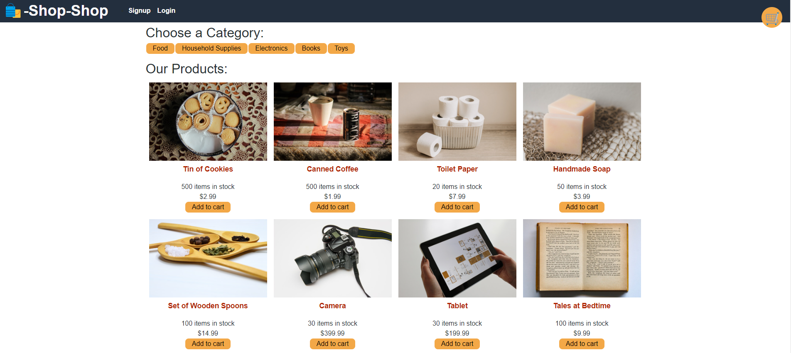
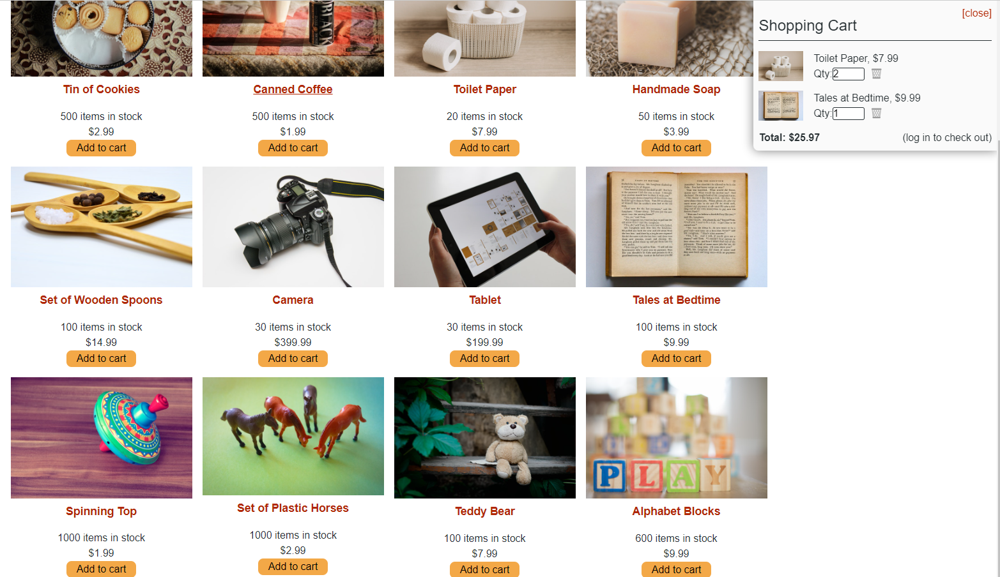

# Redux Store

## In this application, you will find an e-commerece store built using stripe and redux. Users can login and view/add products to their carts for purchase.

[Application Link on Heroku](https://sheltered-gorge-53162.herokuapp.com/)

---

## 
## 

## Table of Contents
  - [Installation](#installation)
  - [Usage](#usage)
  - [License](#license)
  - [Contributing](#contributing)
  - [Tests](#tests)
  - [Questions](#questions)

---
## Installation

A user can clone the files found in this repo then install the required node packages by running `npm i` in the command-line application. Next, either run the command `npm run start dev` in terminal to launch the application locally, or publish the app to Heroku.

## Usage

After installing the necessary node packages, and running the application build, the application can be run on a local server or hosted on Heroku.

## License

This application is unlicensed

## Contributing

Visit my GitHub or Send me an email

## Tests

There are no tests written at this time

---
## Questions

If you have any questions, please visit my GitHub or send me an email.

[GitHub Link](https://github.com/momaki9)

[Email Me!](mailto:mostafa_m9@yahoo.com)